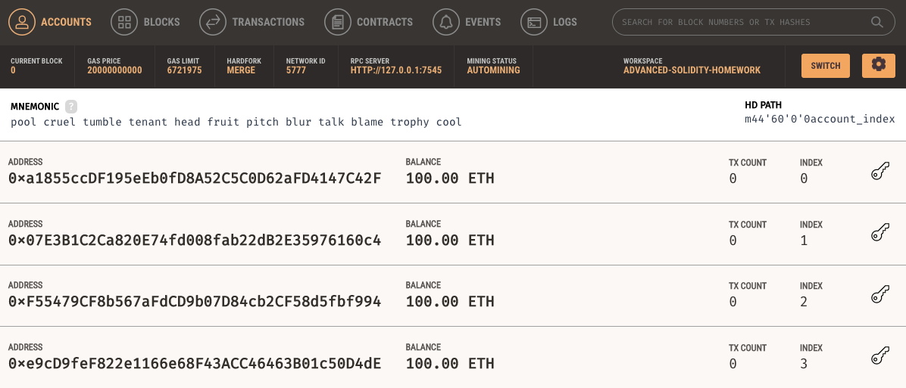
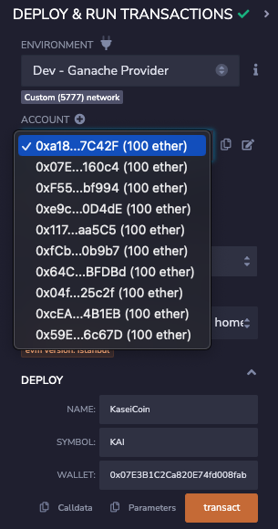
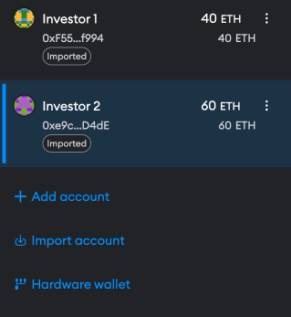

# Token Crowdsale

## Overview
In the journey to establish the first human colony on Mars, the Martian Aerospace Agency presented a unique challenge: developing a monetary system for the settlers on the Red Planet. Leveraging the power and potential of blockchain technology, this project introduces KaseiCoin, a new cryptocurrency designed exclusively for the Mars colony.

## Project Outline
**KaseiCoin (ERC-20 Token):**

- A standard fungible token compliant with the ERC-20 specifications. This forms the cornerstone of the Martian economy.

**KaseiCoin Crowdsale:**

- A mechanism through which Earth inhabitants can participate in the Martian economy by purchasing KaseiCoin tokens.

**Deployment Contract:**

- Efficiently deploys the KaseiCoin and its Crowdsale, ensuring a smooth launch for the cryptocurrency.

## Smart Contracts
**KaseiCoin Token**

The `KaseiCoin.sol` contract defines our ERC-20 token.

**Essential features include:**
- Standard token metadata (name, symbol, decimals).

- Minting capabilities to produce new tokens.
---
**KaseiCoin Crowdsale**

Utilising the `KaseiCoinCrowdsale.sol` contract, we've established:

- Crowdsale rate, determining how many tokens one ether can buy.

- Wallet address, where the funds raised during the crowdsale will be forwarded.

- Integration with the KaseiCoin token, allowing for the minting and distribution of tokens upon purchase.

---

**Deployment**

The `KaseiCoinCrowdsaleDeployer.sol` contract facilitates:

- Deployment of the KaseiCoin token and its crowdsale.

- Storage of contract addresses post-deployment for easy reference.

# Evaluation Evidence
**Compiled Contracts**

--
**Deploying To Local Blockchain**

- Ganache Accounts

- Remix & Ganache Synced

---
**Purchasing Tokens Using MetaMask**
- **Investor 1**

- **Investor 2**

---
**Checking Balances**

- At Address

- Token Contract

- KAI Balance Of Investor 1

- KAI Balance Of Investor 2

**Ganache Account Balances**

**MetaMask Account View**

---
### Summary
The Martian Token Crowdsale project is an innovative initiative to usher in a new era of interplanetary commerce. Through the creation of KaseiCoin, not only do we provide Mars settlers with a robust monetary system, but we also offer Earth inhabitants a unique opportunity to be part of this groundbreaking venture.